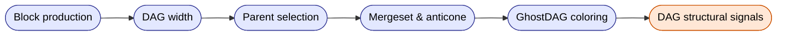
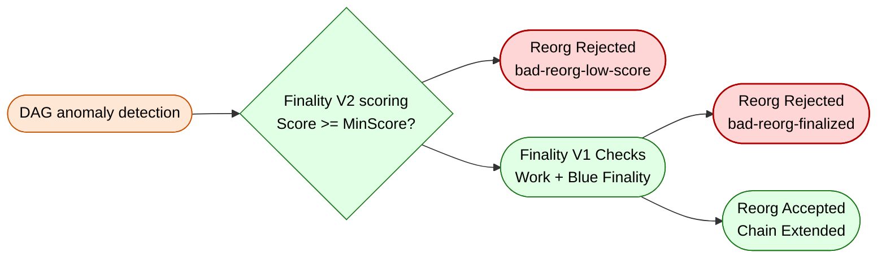

# Megabytes BlockDAG

    
A **BlockDAG** (Directed Acyclic Graph of Blocks) is a generalization of the traditional blockchain structure.  
Instead of forcing every block to extend a single linear chain, a BlockDAG allows **multiple valid blocks to exist at the same height**, forming a graph of partially ordered blocks.

This reflects real-world mining conditions: multiple miners may find a block at nearly the same time, and network propagation delays mean valid work should not be discarded.  
A DAG preserves this work instead of orphaning it.

Megabytes adopts a BlockDAG for several structural and security advantages:

- **Robustness to honest mining concurrency**  
  Multiple valid blocks produced at the same height are kept in the DAG rather than orphaned.

- **Improved security visibility**  
  Abnormally wide layers, isolated subgraphs, and low-connectivity branches become easy to detect.

- **Stronger reorg resistance**  
  Alternative branches reveal their structural weakness through DAG properties such as mergeset size, anticone, or isolation.  
  This enables powerful veto mechanisms in the finality engine.

- **Better multi-algorithm coherence**  
  DAG connectivity exposes unrealistic or manipulated PoW algorithm distributions more clearly than a linear chain.

### Objectives of the Megabytes DAG design

The Megabytes BlockDAG is engineered around three core goals:

- **Structured multi-parent mining**  
  Each block references the best blue parent plus additional DAG parents to maintain strong global connectivity.

- **Attack detection through graph structure**  
  DAG properties (width, anticone, mergeset, isolation) reveal suspicious mining behavior well before finality evaluation.

- **Reduced orphaning of honest work**  
  Honest miners contributing valid blocks nearly simultaneously are preserved inside the DAG, improving fairness and liveness.

---

## DAG Glossary (Key Terms)

### Blue Block
A block selected by GhostDAG as part of the honest, well-connected chain.  
Blue blocks have small anticone sets and strong DAG connectivity.

### Red Block
A valid block that is not chosen for the blue set.  
Red blocks typically have weaker connectivity, a larger anticone, or arrive too late.  
They remain part of the DAG but do not represent the canonical structure.

### Width
The number of blocks produced at the same height.

- `width = 1` → fully converged  
- `width = 2` or `3` → normal short-term concurrency  
- `width >= 4` → possible attack or poor network connectivity  

Width is useful to detect abnormal or suspicious behavior.

### Parent
A block listed inside `dag_parents`.  
A block may have multiple parents:
- one **blue parent** (best, well-connected parent)  
- additional **DAG parents** to maintain global connectivity  

This multi-parent model reduces orphaning and improves DAG robustness.

### Children
Blocks that reference the current block as one of their parents.  
Children are useful to visualize forward connectivity and detect divergence near the tip.

### Anticone
The set of blocks that are neither ancestors nor descendants of a given block.  
A large anticone usually indicates a block that is less well integrated into the DAG and is often classified as red.

### Mergeset
All blocks that must be considered when integrating a new block into the DAG.  
GhostDAG uses mergeset properties to decide block color (blue or red) and to evaluate chain quality.

### Tip
A block with no children.  
Multiple tips indicate parallel mining or temporary forks (width > 1 near the head).

### Isolated DAG (Megabytes-specific)
A branch with extremely weak connectivity to the honest DAG.  
Such branches exhibit very low DAC quality and are subject to Finality V2 isolation veto.

### Algorithm Divergence (R_algo)
Measures how a branch’s PoW algorithm distribution deviates from the honest chain.  
Strong mono-algo bias or unrealistic proportions are treated as suspicious behavior in the security model.

---

## High-Level Overview

Megabytes implements a **multi-parent BlockDAG** where each block references:

- one **main blue parent** (the best chain candidate)
- zero or more **additional DAG parents** (recent blocks not in the ancestor chain)

This ensures that the DAG remains highly connected, minimizes orphaning, and allows the consensus engine to evaluate the structural quality of competing branches.

Unlike a traditional blockchain, where every height contains exactly one block, a BlockDAG allows **multiple blocks at the same height**.  
This phenomenon is called *width*.

- A width of 1 indicates perfect convergence.
- Widths of 2 or 3 can occur naturally due to network latency or simultaneous mining.
- Wider layers highlight unusual or suspicious block production behavior.

Megabytes does **not discard** these parallel blocks.  
Instead, all blocks remain part of the DAG and are later classified as:

- **blue blocks** (well-connected, high-quality)
- **red blocks** (valid but less well integrated)

This classification is performed by a simplified GhostDAG logic, which evaluates:

- mergeset quality  
- anticone relationships  
- overall DAG connectivity  

This allows Megabytes to:

- preserve honest work,
- detect structurally abnormal forks,
- expose isolated or manipulated branches,
- provide high-confidence finality when combined with Finality V1 and V2.

A visual example of a typical DAG evolution (width 3 → width 2 → width 1) is provided in the README.

---
## 4. Block Creation Rules

When a miner produces a new block in Megabytes, the block must integrate correctly into the BlockDAG.  
To ensure this, Megabytes follows a set of deterministic rules that define how a valid block is constructed and how it connects to the existing DAG.

### 4.1 Parent Selection Overview

Each block must reference:

1. **One main parent**  
   - This is the best blue block currently known.
   - It serves the role similar to the "previous block hash" in a linear chain.
   - It ensures continuity with the canonical DAG path.

2. **Zero or more additional DAG parents**  
   - These are recent blocks that are not ancestors of the main parent.
   - They help maintain high DAG connectivity and reduce orphaning.
   - Additional DAG parents are committed inside the coinbase transaction.

This multi-parent design ensures that the DAG reflects all recent mining activity, even when miners produce blocks nearly simultaneously.

### 4.2 Block Header Structure (DAG-specific Fields)

A Megabytes block contains:

- `hashPrevBlock`  
  Reference to the main (blue) parent.

- `dag_parents_commitment`  
  A serialized commitment of the additional DAG parents, included inside the coinbase.

- Standard Bitcoin-like fields  
  (`version`, `nBits`, `nNonce`, `hashMerkleRoot`, timestamps, etc.)

The DAG commitment ensures that all nodes converge on the same DAG topology.

### 4.3 Rules for Choosing Additional DAG Parents

A block may include multiple DAG parents if:

- the parent is not an ancestor of the main parent,  
- the parent is recent (within the DAG parent selection window),  
- adding the parent does not exceed the maximum allowed parent count.

This mechanism:

- preserves honest blocks that would otherwise become orphans,
- improves network liveness and parallelism,
- provides more data for GhostDAG scoring.

### 4.4 Result of Block Creation

By following these rules:

- The DAG forms naturally as miners produce blocks concurrently.
- All honest work is incorporated instead of discarded.
- GhostDAG can later classify blocks into blue and red sets.
- Structural anomalies (isolated blocks, unnatural width, etc.) become detectable.

This block creation model is the foundation of Megabytes' DAG-based consensus.

---

## 5. Parent Selection Algorithm

When a new block is mined, it must attach itself to the BlockDAG in a way that preserves global connectivity, minimizes orphaning, and reflects recent network activity.  
Megabytes achieves this using a structured parent selection algorithm with two components:

- selection of the **main parent** (the best blue tip), and  
- selection of **additional DAG parents** (recent non-ancestor blocks).

This parent model ensures that all honest mining activity is incorporated into the DAG, even under high concurrency.

### 5.1 Selecting the Main Parent (Blue Tip)

The main parent of every new block is chosen as:

- the block with the **highest blue score**,  
- among all current DAG tips known to the miner.

This block represents the most structurally connected extension of the DAG and serves as the canonical continuation of the consensus history.

The `hashPrevBlock` field of the header always references this main parent.

### 5.2 Selecting Additional DAG Parents

After choosing the main parent, the miner may include **additional parents** to improve DAG connectivity.

A block `X` may be added as a DAG parent if:

1. `X` is **not an ancestor** of the main parent  
2. `X` is **recent**, within the DAG-parent window (implementation-specific)  
3. The final number of DAG parents does not exceed the protocol’s maximum  
4. Including `X` helps reduce future orphaning and improves mergeset quality  

These DAG parents are committed in the coinbase transaction so all nodes observe the same structure.

### 5.3 Rationale for Multi-Parent Selection

The multi-parent model enables:

- **high connectivity**, preventing long isolated subgraphs  
- **lower orphan rates**, since concurrent blocks are not discarded  
- **clearer structural information** for GhostDAG to classify blue and red blocks  
- **better visibility of attack attempts**, since abnormal patterns (wide layers, sudden isolation) appear directly in the DAG

### 5.4 Parent Selection Example

Given a set of tips:

- `B19a` (blue, main tip)  
- `B19b` (red, recent)  
- `B19c` (red, recent)

A miner producing block `B20` will select:

- **Main parent:** `B19a`  
- **Additional DAG parents:** `B19b`, `B19c` (if within the allowed window)  

The resulting block improves DAG cohesion and preserves honest work from all miners.

### 5.5 Outcome of the Parent Selection Algorithm

This parent selection approach ensures that:

- all honest concurrent blocks become part of the DAG  
- the DAG remains tightly connected and easy to analyze  
- GhostDAG can accurately compute blue/red classification  
- the structure is naturally resilient against private or isolated forks  

This algorithm forms the backbone of Megabytes’ BlockDAG topology.

---

## 6. GhostDAG Scoring & Coloring (Blue / Red)

GhostDAG is the mechanism used by Megabytes to determine which blocks form the
well-connected "honest" chain (blue blocks) and which blocks represent
alternative, less-connected branches (red blocks).  
Unlike a linear blockchain, Megabytes preserves all blocks, even when multiple
are created at the same height. GhostDAG then classifies these blocks based on
their structural relationships inside the DAG.

### 6.1 Core Idea

GhostDAG evaluates every new block based on how well it fits into the global
DAG structure. A block becomes **blue** if it:

- belongs to the most connected subgraph,
- has a small anticone (few blocks that are neither its ancestors nor descendants),
- forms a coherent mergeset with its parents,
- aligns with the natural propagation of honest miners.

A block becomes **red** if it:

- conflicts structurally with better-connected blocks,
- has a large anticone,
- attaches in a way that is inconsistent with honest mining behavior,
- is part of a weaker, parallel branch.

Blue blocks define the preferred chain for miners and nodes.  
Red blocks remain valid and stored, but do not contribute to the main sequence.

### 6.2 Mergeset Construction

For a block `B`, the **mergeset** is the set of all blocks that must be
considered when integrating `B` into the DAG.

It includes:

- the parents of `B`,
- recursively, the mergesets of those parents,
- excluding blocks that are already ancestors of the main parent.

This mergeset is central to determining:

- how many competing blocks exist around `B`,
- the size of its anticone,
- how well-connected `B` is relative to alternative branches.

Blocks with mergesets structurally similar to the main parent are more
likely to be classified as blue.

### 6.3 Anticone Evaluation

For any block `B`, the **anticone** is the set of blocks that:

- are not ancestors of `B`,  
- are not descendants of `B`.

A large anticone means that `B` is poorly connected relative to others.  
Honest miners naturally produce blocks with **small anticones**, because
their blocks propagate rapidly and reference similar parent sets.

GhostDAG uses anticone size as a key indicator:

- **small anticone → likely blue**,  
- **large anticone → likely red**.

### 6.4 Coloring Rule (Blue vs Red)

GhostDAG colors a block `B`:

- **Blue**, if the size of its mergeset anticone is within acceptable limits
  compared to the main parent.
- **Red**, if its anticone exceeds the structural threshold for that depth.

In Megabytes’ simplified GhostDAG:

1. The main parent of a new block defines the preferred ordering.
2. Blocks that are consistent with the main parent's mergeset become blue.
3. Blocks that diverge too strongly (too large anticone) become red.
4. Red blocks do not affect the blue score of future blocks.

This incremental process allows the DAG to naturally converge even when width
temporarily grows due to concurrent mining.

### 6.5 Blue Score

The **blue score** of a block is the count of blue blocks in its past set
(ancestors).  
It is used to:

- rank competing tips,
- choose the main parent for new blocks,
- drive chain convergence.

A block with a higher blue score generally reflects a stronger and more
consistent history.

### 6.6 Role of GhostDAG in Chain Convergence

When multiple blocks coexist at the same height (width > 1):

- GhostDAG identifies one block as blue (best structural fit),
- the others become red but remain part of the DAG,
- future blocks reference the blue block as their main parent,
- additional DAG parents maintain connectivity to red blocks.

This structure ensures that:

- honest blocks are preserved,
- the DAG does not fragment,
- the network converges smoothly toward a single blue path,
- red blocks never overwrite consensus history but remain fully valid.

### 6.7 Summary

GhostDAG provides Megabytes with:

- a robust way to classify blocks under high concurrency,
- deterministic blue/red coloring,
- a structural basis for selecting the canonical path,
- clean convergence even when temporary forks occur,
- the foundation for higher-level mechanisms like Finality V2 (isolation and scoring).

By separating block validity (all blocks are valid) from block preference
(blue vs red), Megabytes maintains a highly connected DAG that is resistant to
attacks and consistent across all nodes.

---

## 7. Width Evolution & Convergence

In a BlockDAG, multiple blocks may be created at the same height due to natural
mining concurrency or network propagation delay. The number of blocks at a given
height is called the **width** of that layer.

Megabytes preserves all such blocks and relies on GhostDAG to classify them and
ensure eventual convergence.

### 7.1 What Determines Width?

Width increases when:

- two or more miners find a block nearly simultaneously,
- blocks propagate slowly across the network,
- the DAG becomes temporarily desynchronized due to latency,
- multiple mining algorithms produce blocks in close succession.

Width does **not** indicate invalidity or misbehavior by itself.  
Short-term widths of 2–3 are normal in decentralized mining.

### 7.2 Natural Width Examples

Typical occurrences:

- **width = 1**  
  Full convergence; only one tip at this height.

- **width = 2**  
  Two miners produce blocks at nearly the same time.  
  Expected in any PoW network.

- **width = 3 or more**  
  Higher concurrency, or network delay.  
  Still valid and handled by the DAG.

Only persistent, high widths across many consecutive heights may indicate structural or behavioral anomalies.

### 7.3 Width Reduction Through GhostDAG

When width > 1 at a given height:

1. GhostDAG evaluates all blocks at that height.
2. One block becomes **blue** (best structural fit).
3. Others become **red** but remain in the DAG.
4. New blocks choose the blue block as the main parent.
5. DAG parents ensure the red blocks remain connected.

This naturally reduces width at the next height.

Example:

- Height 19 has 3 blocks (width 3)
- Height 20 has 2 blocks (width 2)
- Height 21 converges to 1 block (width 1)

This process mirrors what happens in practice:

- concurrency → multiple blocks  
- evaluation → classification  
- convergence → one preferred path  

### 7.4 Why Width Converges

Width shrinks because miners extend the **blue tip** (highest blue score):

- The main parent is always chosen from blue blocks.
- Red blocks are not extended directly.
- Blue blocks accumulate higher blue scores.
- This positive-feedback cycle ensures the DAG always converges toward a single path.

Additional DAG parents prevent fragmentation by:

- connecting red blocks into the graph,
- reducing the likelihood of long isolated subgraphs,
- improving mergeset consistency.

### 7.5 What Abnormal Width Looks Like

Short-term widths of 2–3 are normal.  
However, these patterns are unusual and may indicate attack behavior:

- **width >= 4 repeatedly**  
  Suggests aggressive parallel block production or poor connectivity.

- **width spikes concentrated in a single miner or algorithm**  
  Suggests a biased fork or a manipulated branch.

- **width increases but DAG parents show weak connectivity**  
  Can indicate a private or isolated fork.

These cases are not rejected by the DAG layer alone, but they become
highly visible to GhostDAG and Finality V2, which can veto structurally abnormal branches.

### 7.6 Summary

- Width represents the number of blocks at a given height.
- Temporary increases are normal due to decentralized mining.
- GhostDAG classifies blocks and guides the network toward convergence.
- Miners extend blue blocks, which steadily reduces width.
- Multi-parent DAG connectivity preserves all honest work.
- Abnormally high or persistent width is detectable and may indicate malicious behavior.

Width evolution is a key indicator of the network’s health and plays an important
role in Megabytes’ structural consensus model.

---

## 8. Mergeset Construction (Detailed)

The **mergeset** of a block is the set of blocks that must be considered when
integrating the block into the DAG.  
It plays a central role in:

- GhostDAG blue/red classification,  
- anticone evaluation,  
- convergence behavior,  
- and attack detection.

Mergeset construction is deterministic and performed for every new block.

### 8.1 Formal Definition

For a block **B**, its mergeset consists of:

1. **All parents of B**  
   (main parent + additional DAG parents),
2. **All mergeset blocks of those parents**,  
3. **Excluding blocks that are already ancestors of the main parent.**

The last step is crucial: it prevents re-processing large ancestor sets and
keeps mergeset compact.

### 8.2 Purpose of the Mergeset

The mergeset provides the structural context needed to evaluate:

- how similar B is to its main parent,
- how much additional work B introduces,
- how consistent B is with honest miner connectivity,
- the anticone size (divergence),
- and whether B fits naturally into the canonical DAG.

From this, GhostDAG derives:

- **Blue recognition** (if mergeset fits main parent),
- **Red classification** (if mergeset diverges too much),
- **Blue score increase** (count of blue ancestors).

### 8.3 Mergeset Algorithm (Simplified)

Given:

- `P0` = main parent (highest blue score)
- `P1..Pk` = additional DAG parents

The mergeset is built as follows:

1. `M = {}` (empty set)
2. For each parent `Pi`:
   - Add `Pi` to `M`
   - Add all blocks in `Pi`’s mergeset to `M`
3. Remove any block from `M` that is an ancestor of `P0`

This yields a compact, non-redundant view of the local DAG structure around B.

### 8.4 Why We Exclude Ancestors of the Main Parent

The main parent defines the preferred chain.  
Any block that is already an ancestor of the main parent:

- is guaranteed to be included in B’s ancestor set,
- does not help distinguish structural divergence,
- would artificially inflate mergeset size.

Therefore, excluding `Ancestors(P0)` makes mergeset:

- smaller,  
- more meaningful,  
- and better aligned with GhostDAG's design.

### 8.5 Example: Mergeset with Width > 1

Consider a layer with width 3:

- Blocks A, B, C at height 19  
- The new block D at height 20 selects:

   - **main parent** = A  
   - **DAG parents** = {B, C}

Each parent contributes its mergeset:

- A contributes `MA`
- B contributes `MB`
- C contributes `MC`

Mergeset(D) = {A, B, C} ∪ MA ∪ MB ∪ MC  
minus all ancestors(A)

This lets D "see" all valid blocks that define the structural context for height 19.

GhostDAG then checks:

- Are B and C strongly connected to A?
- Is the anticone small enough?
- Does this mergeset resemble honest propagation?

If yes → D becomes blue.  
If no → D becomes red.

### 8.6 Mergeset in Attack Scenarios

Mergeset structure is a powerful attack detector.

#### Case 1: Private Parallel Mining

A privately mined chain has:

- fewer DAG parents,
- weaker connectivity,
- very small mergesets,
- or mergesets that *do not match* honest network structure.

GhostDAG flags this chain as:

- isolated (FinalityV2 isolation veto), or  
- low-score (R_dac or R_blue penalties).

#### Case 2: Mono-Algo or Biased Mining

If an attacker uses only one PoW algorithm:

- mergeset consistency drops,
- R_algo becomes strongly negative,
- mergeset anticone grows abnormally.

FinalityV2 then rejects the chain.

#### Case 3: High-Width Manipulation

If an attacker tries to produce many blocks at the same height:

- mergesets explode in size,
- anticone becomes large,
- blue classification becomes unlikely.

This makes the block red and prevents the attacker’s chain from becoming canonical.

### 8.7 Mergeset & Convergence

The mergeset is essential for chain convergence:

- Honest miners referencing one main parent tend to produce similar mergesets.
- Similar mergesets → small anticonse → blocks become blue.
- Red blocks accumulate anticonse and stay off the preferred path.

Thus, mergeset stabilizes:

- width → shrinking back to 1,
- blue chain → linearizing the DAG,
- tip selection → predictable and stable.

### 8.8 Summary

Mergeset construction is the heart of the Megabytes DAG.  
It provides:

- structural insight into local DAG shape,
- consistency checks across parents,
- the basis for GhostDAG’s blue/red classification,
- a foundation for FinalityV2 attack rejection,
- and a deterministic mechanism ensuring long-term chain convergence.

Every new block must integrate cleanly into this mergeset logic to be considered
part of the canonical DAG structure.

---

## 9. RPC Interpretation

This specification describes the structural and algorithmic behavior of the Megabytes BlockDAG.

For detailed RPC commands, examples, and expected outputs, please refer to:

**[DAG_RPC_SPEC.md](./DAG_RPC_SPEC.md)**

This companion document provides complete descriptions for:

- `getblockdag`
- `getdaglayer`
- `getdagstats`

including:

- parameter definitions  
- response fields  
- real examples from regtest  
- how to interpret DAG parents, children, mergeset width, blue score, MHIS, and more.

The DAG_SPEC explains *how the DAG works*.  
The DAG_RPC_SPEC explains *how to query and inspect it*.

---

## 10. DAG Anomaly Detection

While the BlockDAG naturally accommodates honest concurrency (width 2–3, temporary forks),
certain structural patterns indicate abnormal or malicious behavior.  
Megabytes detects these anomalies early, using local DAG metrics even before
FinalityV2 scoring is applied.

Anomalies do not imply invalid blocks, but they influence:

- blue/red classification,
- mergeset consistency,
- R_dac (DAG connectivity),
- R_algo (PoW algorithm distribution),
- and eligibility for reorganization.

DAG anomaly detection provides the first structural filter for attack resistance.

### 10.1 DAG Isolation (Low Connectivity)

A block or branch is considered **isolated** when:

- it references very few recent blocks,
- its parent set lacks diversity,
- its mergeset is small or inconsistent,
- it does not attach meaningfully to the honest DAG.

Isolated branches typically arise from:

- private mining,
- aggressive withholding,
- eclipse-style mining,
- deliberate attempts to create invisible forks.

Effects:

- R_dac becomes negative (poor DAG connectivity),
- mergesets shrink unnaturally,
- GhostDAG flags blocks as structurally weak,
- FinalityV2 can immediately reject reorgs ≥ 3 blocks with  
  `bad-reorg-isolated-dag`.

Isolation is one of the strongest signals of malicious intent.

### 10.2 Abnormal Width (Excessive Parallel Blocks)

Honest concurrency usually creates:

- width = 1 → normal convergence
- width = 2 or 3 → standard PoW race

But persistent or repeated large widths can indicate:

- miner attempting high-volume parallel block generation,
- timestamp manipulation,
- lack of propagation (possible partition),
- intentional flooding of the DAG.

Symptoms:

- large mergesets,
- large anticonse,
- difficulty determining a blue block,
- blue score divergence.

GhostDAG handles short-term width spikes normally,
but long-term wide layers downgrade structural trust and reduce eligibility
for canonical chain advancement.

### 10.3 Mergeset Divergence

Mergesets should remain similar among honest blocks produced at the same height.

Signs of mergeset divergence:

- children select very different parent sets,
- mergeset size varies too much among parallel blocks,
- mergesets contain inconsistent ancestor relationships,
- mergesets conflict with the main parent’s mergeset.

Causes:

- manipulated parallel forks,
- timestamp drifting attacks,
- heavy withholding,
- selective revelation.

Effects:

- increased anticone size → red classification,
- reduced blue score for the attacker’s blocks,
- R_blue and R_dac penalties,
- reduced reorg eligibility under FinalityV2 scoring.

### 10.4 Timestamp Drift and Compressed History

Attackers often attempt to mine quickly in private by squeezing timestamps.

Anomalies include:

- multiple blocks with nearly identical timestamps,
- inter-block spacing inconsistent with 60-second target,
- compressed ancestor structure (small mergesets),
- MHIS warnings (history window too compressed).

Detection Path:

1. MHIS flags compressed timelines.  
2. Mergesets become shallow → low structural trust.  
3. FinalityV2 scoring penalizes unrealistic progression.

A reorg with compressed timestamps is typically rejected at MHIS or isolation stage.

### 10.5 Algorithm Distribution Anomalies (R_algo)

Megabytes uses multiple PoW algorithms.  
Honest mining produces a **stochastic mix** of these algorithms.

Algorithm anomalies include:

- 100% mono-algo forks,
- statistically biased distributions (e.g., 90% one algo),
- sudden shifts in dominant algo usage,
- forks with unrealistic PoW sequences compared to the honest chain.

Effects:

- R_algo becomes strongly negative,
- Score < MinScore → reorg veto,
- blocks may remain blue or red structurally but still fail FinalityV2.

This mechanism protects the network even when DAG structure alone does not reveal an attack.

### 10.6 Short-Range vs Deep Anomalies

| Depth | Layer Triggered | Expected Behavior |
|-------|------------------|------------------|
| d = 1–2 | GhostDAG only | Normal PoW competition; anomalies tolerated |
| d ≥ 3 | Isolation Check | Isolated forks immediately rejected |
| d ≥ nFinalityV2MinDepthScore | Score Veto | DAG anomalies, biased algo mix, or poor mergesets → veto |
| d ≥ MHIS Window | MHIS Reject | Deep or compressed history blocks invalid |

Each depth uses progressively stronger anomaly detectors.

### 10.7 How Anomaly Detection Feeds FinalityV2

Anomaly metrics shape the four scoring components:

- **R_work** → work advantage
- **R_blue** → mergeset & blue-score coherence
- **R_dac** → connectivity and isolation detection
- **R_algo** → realistic PoW distribution

FinalityV2 combines these:

Score = K_Work·R_work  
       + K_Blue·R_blue  
       + K_DAC·R_dac  
       + K_Algo·R_algo

Branches exhibiting any anomaly produce negative or insufficient score,
resulting in `bad-reorg-low-score`.

### 10.8 Summary

Megabytes uses structural, statistical, and temporal indicators to detect DAG anomalies:

- isolation → private or poorly-connected forks,  
- abnormal width → excessive concurrency or flooding,  
- mergeset divergence → structural inconsistency,  
- timestamp compression → unrealistic timeline generation,  
- algo-mix anomalies → non-honest mining behavior.

These detectors strengthen GhostDAG and feed directly into FinalityV2,
making Megabytes highly resistant to deep reorgs—  
even those engineered with strong hashrate.

DAG anomalies are the first line of defense against non-honest chain behavior.

---

## 11. Conclusion

The Megabytes BlockDAG is designed as a modern, security-oriented evolution of
traditional blockchain consensus.  
Rather than forcing a single linear chain, the DAG structure captures the full
parallelism of decentralized mining while preserving deterministic convergence.

Key properties of the Megabytes DAG:

- **Preserves all honest blocks**, even during concurrency.
- **Provides structural insight** into mining behavior through mergesets,
  anticonse, and width.
- **Detects anomalies early**, including isolation, timestamp drift,
  mergeset divergence, and algorithm bias.
- **Integrates seamlessly with FinalityV2**, enabling strong vetoes against
  malicious reorg attempts.
- **Ensures predictable convergence** via GhostDAG blue/red coloring and
  multi-parent connectivity.
- **Feeds high-quality structural data** into the scoring engine that
  underpins Megabytes’ reorg resistance.

Together, these features give Megabytes a uniquely strong foundation for
decentralized security—combining the flexibility of a DAG with the stability and
predictability of traditional PoW finality layers.

The DAG is not only a data structure:  
it is a lens through which the network’s honesty, connectivity, and behavior
can be analyzed in real time.

---

## 12. Future Work

While the current DAG implementation is robust and production-ready, several
avenues exist for future refinement and research:

### 12.1 Adaptive MHIS Windows
Dynamically adjusting the MHIS history window based on recent network behavior
could tighten long-range protection under abnormal conditions.

### 12.2 Enhanced Isolation Metrics
More advanced connectivity metrics (e.g., weighted DAG reachability, cluster analysis)
could improve early detection of private mining attempts.

### 12.3 Algorithm Distribution Modeling
Statistical or machine-learning models could predict expected PoW algorithm mixes,
making R_algo more adaptive when mining dynamics shift over time.

### 12.4 Fine-Grained Mergeset Analytics
Measuring variance across mergesets over moving windows could improve anomaly
detection and reduce false positives.

### 12.5 Visualization Tools
Graph visualizers (e.g., DAG explorers, mergeset viewers) would help researchers
and node operators better understand DAG behavior in real time.

### 12.6 Optional Network-Layer Protections
Although outside the scope of current consensus rules, future versions may
explore decentralized mechanisms to resist eclipse attacks and targeted partitioning.

---

Megabytes’ philosophy is **progressive, transparent hardening**:  
Each improvement is measurable, incremental, and grounded in real-world
attack models and behavior observed on the DAG itself.

The DAG is the backbone of Megabytes’ structural security,  
and future refinements will continue to strengthen its role in ensuring  
**a stable, manipulation-resistant Proof-of-Work network.**
