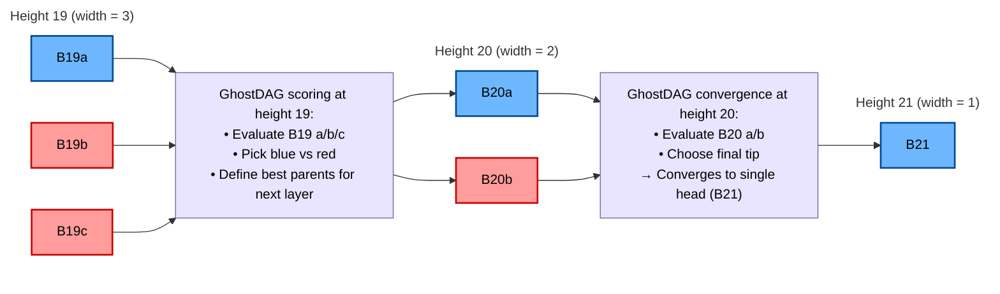

# megabytes-dag-specification
Comprehensive specification and documentation of the Megabytes BlockDAG, including GhostDAG scoring, DAG parents, MHIS, finality rules, and DAG-oriented RPC interfaces.

---

## DAG Glossary (Key Terms)

### Blue Block
A block selected by GhostDAG as part of the honest, well-connected chain.  
Blue blocks have small anticone sets and strong DAG connectivity.

### Red Block
A valid block that is not chosen for the blue set.  
Red blocks typically have weaker connectivity, a larger anticone, or arrive too late.  
They remain part of the DAG but do not represent the canonical structure.

### Width
The number of blocks produced at the same height.

- `width = 1` → fully converged  
- `width = 2` or `3` → normal short-term concurrency  
- `width >= 4` → possible attack or poor network connectivity  

Width is useful to detect abnormal or suspicious behavior.

### Parent
A block listed inside `dag_parents`.  
A block may have multiple parents:
- one **blue parent** (best, well-connected parent)  
- additional **DAG parents** to maintain global connectivity  

This multi-parent model reduces orphaning and improves DAG robustness.

### Children
Blocks that reference the current block as one of their parents.  
Children are useful to visualize forward connectivity and detect divergence near the tip.

### Anticone
The set of blocks that are neither ancestors nor descendants of a given block.  
A large anticone usually indicates a block that is less well integrated into the DAG and is often classified as red.

### Mergeset
All blocks that must be considered when integrating a new block into the DAG.  
GhostDAG uses mergeset properties to decide block color (blue or red) and to evaluate chain quality.

### Tip
A block with no children.  
Multiple tips indicate parallel mining or temporary forks (width > 1 near the head).

### Isolated DAG (Megabytes-specific)
A branch with extremely weak connectivity to the honest DAG.  
Such branches exhibit very low DAC quality and are subject to Finality V2 isolation veto.

### Algorithm Divergence (R_algo)
Measures how a branch’s PoW algorithm distribution deviates from the honest chain.  
Strong mono-algo bias or unrealistic proportions are treated as suspicious behavior in the security model.

---

