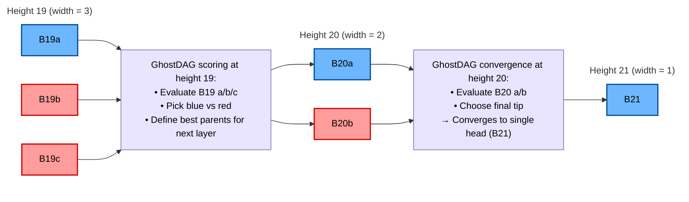

# megabytes-dag-specification
Comprehensive specification and documentation of the Megabytes BlockDAG, including GhostDAG scoring, DAG parents, MHIS, finality rules, and DAG-oriented RPC interfaces.

---

**Full technical specification:**  
See the complete DAG glossary, definitions, and GhostDAG rules in  
[DAG_SPEC.md](./DAG_SPEC.md)

