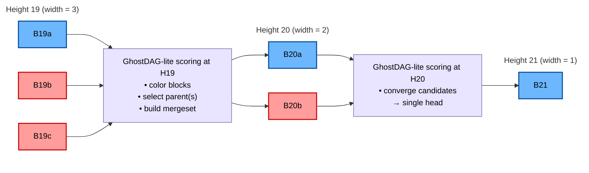
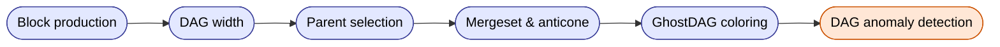

# Megabytes BlockDAG Specification

This repository documents the full structural behavior of the **Megabytes (MGB) BlockDAG**,  
including node connectivity, mergeset rules, blue/red classification, and RPC interpretation.

Megabytes uses a **multi-parent BlockDAG** (8 DAG parents per block) combined with a  
GhostDAG-inspired scoring system to ensure strong convergence, high visibility of attacker behavior,  
and robust analysis of mining patterns across multiple algorithms.

Unlike single-algorithm BlockDAGs where the blue score implicitly represents work, Megabytes separates cost (PoW) from topological quality and network convergence. 
Tip selection is hierarchical: accumulated work dominates at large scales, while DAG quality and algorithmic balance are used as tie-breakers under comparable cost.

## What This Repository Contains

### **1. [DAG_SPEC.md](./DAG_SPEC.md)** 
The complete BlockDAG specification, including:

- Block creation rules  
- Parent selection (main parent + DAG parents)  
- Mergeset construction  
- Anticone evaluation  
- GhostDAG-lite blue/red classification  
- Width evolution and convergence mechanisms  
- DAG anomaly detection (isolation, algo bias, timestamp drift, etc.)

This file explains **how the DAG behaves**, not how finality is determined.

---

### **2. [DAG_RPC_SPEC.md](./DAG_RPC_SPEC.md)**
Reference documentation for DAG-related RPCs:

- `getblockdag`
- `getdaglayer`
- `getdagstats`
- `getdagmeta`

Including:

- parameter definitions  
- real regtest examples  
- how to interpret parents, children, mergeset, width, MHIS, and blue scores  

---

## BlockDAG Technical Overview (Key Facts)

---

## Implementation notes (based on current code)

### Consensus: number of DAG parents

The node uses a consensus parameter for the DAG parent count:

- `DAGParentNumber` (default **8**)
- Parent limit helper (typical pattern):  
  `DagParentLimit(consensus) = (DAGParentNumber > 0 ? DAGParentNumber : 8)`

**Important:** some runtime code paths may reserve/allow a higher *cap* (e.g. 16) for safety,
but **consensus should enforce the final accepted count**.

### DAG parent commitment (coinbase OP_RETURN)

DAG parents are committed in coinbase outputs using an OP_RETURN payload (“DAGP”).
On connect:

- the node extracts DAGP hashes from coinbase,
- validates/filters them,
- wires the in-memory DAG edges,
- and (when enabled) persists DAG edges/metadata in the DAG DB.

If DAGP is missing/invalid, the node can fall back to SP-only wiring.

### Startup: DAG rebuild after `LoadBlockIndex()`

On startup, after the block index is loaded and sorted by height, the node rebuilds the **in-memory**
DAG view from the block index:

- `DagRebuildFromBlockIndex(vSortedByHeight)`
- then rebuild children from parents:
  `RebuildDagChildrenFromParentsPublic(...)`

This ensures DAG navigation (parents/children windows, mergeset introspection, etc.) is available even
before any new blocks arrive.

### Reindex behavior (non-fatal)

The node is intentionally tolerant if `LoadBlockIndexDB()` fails *because it decided to trigger reindex*.

- If block index load returns false and `fReindex` became true, the node logs and **returns true**
  so initialization does not fatal.
- `ImportBlocks()` then performs the reindex during the same startup.

There’s also an optional sanity-check pass (based on `hashPrev` existence) that can force reindex
without aborting the startup.

---

## Structural model

### Multi-parent DAG

Each block includes:

- **Selected Parent (SP)**: `hashPrevBlock`
- **DAG Parents (DAGP)**: default 8 recent, non-ancestor blocks

This improves connectivity and reduces fragmentation in concurrent mining environments.

### GhostDAG-lite (coloring)

Megabytes uses a simplified GhostDAG approach:

- **blue** = structurally well-connected blocks
- **red**  = valid blocks that lose the local structural competition
- **blue score** = monotone score that approximates “count of blue ancestors” (implementation-defined)

The goal is deterministic convergence while still exposing concurrency (width) and abnormal patterns.

### Mergeset + anticone

For a given tip, the mergeset captures the local competing region:

- built from parents and their mergesets,
- excluding ancestors of the selected parent,
- producing an analyzable set of concurrent blocks.

The **anticone** reveals blocks that are not in ancestor/descendant relation relative to a reference,
useful for detecting private mining / isolation behavior.

### Width behavior (rule-of-thumb)

- Short-term width 2–3 can be normal (concurrency/noise).
- Persistently high width suggests:
  - private mining / withheld blocks,
  - connectivity problems,
  - timestamp compression,
  - deliberate structural manipulation.

Width tends to reduce naturally as nodes converge to the best head.

---

## Where finality is defined

This repo documents only structural logic.

Finality (reorg acceptance / rejection) is documented in the security model repo: 

https://github.com/SanaMegabytes/megabytes-security-model

- MHIS (history-window safety)
- Finality V1 (work + blue-finality)
- Finality V2 (isolation + scoring)
- attack simulations and reorg tests

The DAG provides structural metrics (e.g., isolation signals, algorithm mix divergence, etc.)
consumed by finality policies, but **finality decisions are out of scope here**.

---

## Contribution

This repository documents consensus-relevant behavior. PRs should prioritize:

- readability,
- verifiability,
- consistency with node behavior.

Changes that affect consensus must include rationale + simulations/regtest evidence.

