# Megabytes BlockDAG Specification

This repository documents the full structural behavior of the **Megabytes (MGB) BlockDAG**,  
including node connectivity, mergeset rules, blue/red classification, and RPC interpretation.

Megabytes uses a **multi-parent BlockDAG** (8 DAG parents per block) combined with a  
GhostDAG-inspired scoring system to ensure strong convergence, high visibility of attacker behavior,  
and robust analysis of mining patterns across multiple algorithms.

## What This Repository Contains

### **1. [DAG_SPEC.md](./DAG_SPEC.md)** 
The complete BlockDAG specification, including:

- Block creation rules  
- Parent selection (main parent + DAG parents)  
- Mergeset construction  
- Anticone evaluation  
- GhostDAG-lite blue/red classification  
- Width evolution and convergence mechanisms  
- DAG anomaly detection (isolation, algo bias, timestamp drift, etc.)

This file explains **how the DAG behaves**, not how finality is determined.

---

### **2. [DAG_RPC_SPEC.md](./DAG_RPC_SPEC.md)**
Reference documentation for DAG-related RPCs:

- `getblockdag`
- `getdaglayer`
- `getdagstats`

Including:

- parameter definitions  
- real regtest examples  
- how to interpret parents, children, mergeset, width, MHIS, and blue scores  

---

## BlockDAG Technical Overview (Key Facts)

```mermaid
flowchart LR

    A([Block production]) --> B([DAG width])
    B --> C([Parent selection])
    C --> D([Mergeset and anticone])
    D --> E([GhostDAG coloring])
    E --> F([DAG anomaly detection])

    %% Styling
    classDef stage fill:#e3e8ff,stroke:#3b3f99,stroke-width:1px,color:#000;
    classDef detect fill:#ffe7d6,stroke:#cc5200,stroke-width:1px,color:#000;
    classDef final fill:#e0ffe4,stroke:#1f7a1f,stroke-width:1px,color:#000;
    classDef reject fill:#ffd6d6,stroke:#b30000,stroke-width:1.5px,color:#000;

    class A,B,C,D,E stage;
    class F detect;
    class G,H,I,J final;
    class R1,R2 reject;
    class ACC final;
```

### **Multi-parent DAG**
Each block includes:

- **1 main parent** (highest blue score)
- **8 DAG parents** (recent non-ancestors)
- All DAG parents are **committed in the coinbase (OP_RETURN)**
  
DAG topology is fully enforced at the consensus level.

This ensures high global connectivity and prevents DAG fragmentation.

### **GhostDAG-lite**
Megabytes uses a simplified version of GhostDAG:

- blue = structurally well-connected blocks  
- red = valid but weaker structural fit  
- blue score = count of blue ancestors  

This allows deterministic convergence even under multi-algo concurrency.

### **Mergeset-based structure**
For each block, the mergeset is constructed using:

- its parents,  
- parents’ mergesets,  
- excluding ancestors of the main parent.

This captures the *local topology* and reveals abnormal mining behavior.

### **Width behavior**
Short-term width 2–3 is normal.  
Persistent width > 3 may indicate:

- private mining  
- poor connectivity  
- timestamp compression  
- structural manipulation  

Width reduction occurs naturally through GhostDAG parent selection.

---

## Where Finality Is Defined

This repository covers **only the structural DAG logic**.

Finality (reorg acceptance / rejection) is defined here:

https://github.com/SanaMegabytes/megabytes-security-model

Including:

- MHIS (history-window safety)
- Finality V2 isolation & scoring  
- Finality V1 work & blue-finality  
- Attack simulations and reorg tests  

The DAG feeds structural metrics (R_blue, R_dac, algorithm mix) into Finality V2,
but **finality decisions are outside the scope of this document**.

---

## Why Megabytes Uses a DAG

The BlockDAG provides:

- natural handling of multi-algo concurrency  
- preservation of all honest blocks  
- better detection of private mining attacks  
- superior visibility into abnormal mining patterns  
- deterministic convergence through GhostDAG  
- graph-theoretic protections before finality rules apply  

Megabytes' DAG is the foundation of its multi-layer security model.

---

## License and Contribution

This repository documents consensus logic.  
Contributions should follow:

- readability  
- verifiability  
- consistency with existing DAG behavior  

Pull requests modifying consensus rules must be accompanied by  
clear rationale and simulations.

